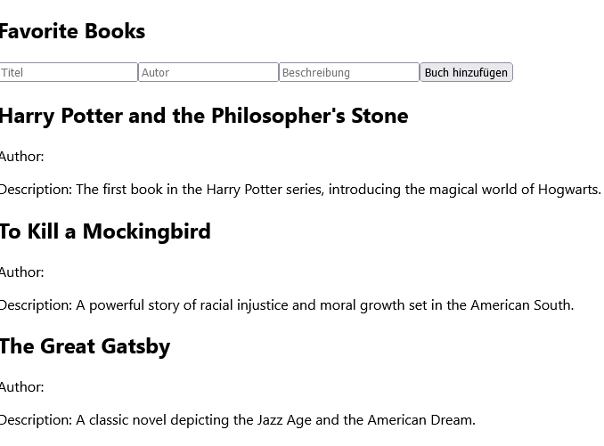

# React - First Components
Bei React dreht sich alles um sog. Komponenten. 

**>>Task 1**: Nehmen Sie dieses Tutorial https://react.dev/learn/your-first-component zum Thema *Components* durch. Durch Klicken auf den Fork-Link (zu finden oben rechts in jedem Codebeispiel) gelangen Sie zur CodeSandbox, wo das gesamte Projekt eingesehen und experimentell bearbeitet werden kann.

**>>Task 2 - Book Gallery** 
Ziel ist die Entwicklung einer Applikation, die die Lieblingsbücher ausgibt. Nachfolgender Screenshot zeigt die gewünschte Ausgabe.   

<div class="text-center">
  
</div>


Erstellen Sie das React-Projekt *bookgallery* (als Teil der UE04). Implementieren Sie sämtlichen Code in der *App.js* - also keine weiteren Dateien erstellen!

Verwenden Sie nachfolgendes Code-Grundgerüst als Ausgansbasis für die Umsetzung.

````jsx
// Die Book-Komponente wird wiederverwendet, um jedes Buch darzustellen
function Book({ title, author, description }) {
  return (
  // Your code...
  );
}

// Die Gallery-Komponente zeigt eine Liste von Lieblingsbüchern an
export default function Gallery() {
  return (
  // Your code...
  );
````

Passen Sie den Import in der *index.js* an.

Abschließend noch die Bücher bzw. die Datengrundlage:

````text
Harry Potter and the Philosopher's Stone

Author: J.K. Rowling
Description: The first book in the Harry Potter series, introducing the magical world of Hogwarts.


To Kill a Mockingbird

Author: Harper Lee
Description: A powerful story of racial injustice and moral growth set in the American South.


The Great Gatsby

Author: F. Scott Fitzgerald
Description: A classic novel depicting the Jazz Age and the American Dream.
````


## Books-Komponenten dynamisch erstellen
Der gegenwärtige Lösungsansatz (siehe solved-Branch) funktioniert zwar, weist jedoch Redundanzen in der *Gallery*-Komponente auf. Diese sollen eliminiert werden. Als Grundlage dient das Array `books`. Es soll eine iterativer Ansatz verwendet werden, um die *Books*-Komponenten zu erstellen. Dazu wird die `map`-Funktion genutzt, um durch jedes Element von `books` zu iterieren. Ein Beispiel für die Verwendung der `map`-Funktion zum Rendern von Listen in React finden Sie hier (https://react.dev/learn/rendering-lists). Statt *li*-Elementen sollen jedoch *Books*-Komponenten erstellt werden. Nachfolgender Code bildet hierbei die Ausgangsbasis.

````javascript
export default function Gallery() {
    const books = [
        {
            title: "Harry Potter and the Philosopher's Stone",
            author: "J.K. Rowling",
            description: "The first book in the Harry Potter series, introducing the magical world of Hogwarts."
        },
        {
            title: "To Kill a Mockingbird",
            author: "Harper Lee",
            description: "A powerful story of racial injustice and moral growth set in the American South."
        },
        {
            title: "The Great Gatsby",
            author: "F. Scott Fitzgerald",
            description: "A classic novel depicting the Jazz Age and the American Dream."
        }
    ];
    return (
        <section>
            <h1>Favorite Books</h1>
            {  /* Iterate over books... */  => (
                <Book
                   // ...and set arguments dynamically 
                />
            ))}
        </section>
    );
}
````
**>>Task 3**: Erstellen Sie die Komponenten dynamisch mit der `map`-Funktion. 

## Wiederverwendbarkeit von Komponenten sicherstellen 
In React ist die Wiederverwendbarkeit von Komponenten ein zentrales Konzept. Um dies zu nutzen, können Sie einen Ordner namens *components* und darin eine Datei mit dem Namen *Book.js* erstellen. Verschieben Sie den relevanten Code in die *Book.js*-Datei und passen Sie die Import-Anweisungen in der *App.js* entsprechend an.

**>>Task 4**: Führen Sie die geforderten Arbeitsschritte durch.


## Buch-Eintrag erstellen
Um einen neuen Eintrag in die Buchliste hinzuzufügen, benötigen wir ein Formular. Das Formular muss Eingabefelder für  *Titel*, *Autor* und *Beschreibungen* sowie einen *Hinzufügen*-Button bereitstellen. Zu platzieren ist das Formular über der Ausgabe der Buchliste. 

````javascript
<form>
  <input
    type="text"
    placeholder="Titel"
  />
  <input
    type="text"
    placeholder="Autor"
  />
  <input
    type="text"
    placeholder="Beschreibung"
  />
  <button>Buch hinzufügen</button>
</form>
````
Im Browser sollte folgendes Ergebnis zu sehen sein. Dass die Darstellung wenig ansprechend ist, ist zunächst nicht von Bedeutung.
<div class="text-center">
  
</div>

Das grundsätzliche Ziel besteht darin, neu erstellte Einträge dem Array `books` hinzuzufügen und sie anschließend im Viewport anzuzeigen. Dies erfordert eine DOM-Manipulation, wie wir bereits aus früheren Übungen (in der 4. Klasse) wissen. 

Das Coole an React ist, dass man die Benutzeroberfläche (DOM) nicht manuell aktualisieren muss, wenn sich die zugrunde liegenden Daten ändern. Hierzu gibt es mit **useState** einen sog. *Hook*. Konkret bedeutet das: Wenn sich der Inhalt von `books` ändert, wird die Komponente automatisch neu gerendert und somit die Benutzeroberfläche aktualisiert. Dieses Konzept nennt man auch Databinding und ist eine grundlegende Funktion in React. Somit ist es leicht, interaktive und dynamische Benutzeroberflächen zu erstellen. 

Eine Komponente kann meherere *State Variables* aufweisen. Wird eine Komponente mehrere Male gerendert (siehe die drei Books-Komponenten im Beispielsfall), hat jede ihren isolierten State. Weitere Informationen zu useState liefert diese Quelle (https://react.dev/learn/state-a-components-memory).

Die Umsetzung auf Code-Ebene gestaltet sich folgendermaßen:

````javascript
//...
export default function Gallery() {
    const [bookTitle, setBookTitle] = useState('');
    const [bookAuthor, setBookAuthor] = useState('');
    const [bookDescription, setBookDescription] = useState('');

    const [books, setBooks] = useState([{
        title: "Harry Potter and the Philosopher's Stone",
        author: "J.K. Rowling",
        description: "The first book in the Harry Potter series, introducing the magical world of Hogwarts."
    },
        {
            title: "To Kill a Mockingbird",
            author: "Harper Lee",
            description: "A powerful story of racial injustice and moral growth set in the American South."
        },
        {
            title: "The Great Gatsby",
            author: "F. Scott Fitzgerald",
            description: "A classic novel depicting the Jazz Age and the American Dream."
        }]);


    return (
        <section>
            <h1>Favorite Books</h1>
            ...
            ))}
        </section>
    );
}
//...
````
Der Code nutzt den **useState**-Hook, um mehrere Zustände in einer React-Komponente zu verwalten. Diese Zustände umfassen *Title*, *Author*, *Description* sowie die Buchliste *books*. Für jeden Zustand wird ein eigener State definiert, was sich am Beispiel *Title* wie folgt gestaltet:

- `bookTitle`: Dies ist die Variable, die den aktuellen Wert des Buchtitels speichert. Beim ersten Rendern der Komponente wird der Initialwert auf Leerstring (siehe unten) gesetzt.
- `setBookTitle`: Dies ist die Funktion, mit der der Wert des Buchtitels aktualisiert wird. Wenn diese Funktion aufgerufen wird, wird der Zustand von `bookTitle` aktualisiert und die Komponente neu gerendert, um die Änderungen anzuzeigen.
- `useState('')`: Dient zur eigentlichen Definition des *Hooks*. Der Wert, der als Argument übergeben wird (in diesem Fall ein Leer-String), wird als Initialwert des *States* verwendet. *useState* gibt also ein Array zurück, das den aktuellen Wert und die Funktion zum Aktualisieren des Zustands enthält.

Schließlich stellt sich die Frage, wie die Werte der Eingabefelder in die entsprechenden Variablen wie `bookTitle` übertragen werden können. Hierfür ist eine weitere Anpassung der JSX-Datei *App.js* erforderlich. 

````javascript
...
function handleBookTitle(event) {
  const newDescription = event.target.value;
  setBookTitle(newDescription)
  console.log(bookTitle);
}
...
<input
  type="text"
  placeholder="Titel"
  value={bookTitle}
  onChange={handleBookTitle}
 />
 ....
````

Das `onChange`-Attribut des Eingabefelds wird genutzt, um die `handleBookTitle`-Funktion aufzurufen, wenn der Benutzer den Wert des Felds ändert. Dies bedeutet, dass jedes Mal, wenn der Benutzer etwas eingibt, die `handleBookTitle`-Funktion ausgeführt wird, um den neuen Wert zu verarbeiten. Durch diese Konfiguration wird sichergestellt, dass der Wert des Eingabefelds immer mit der `bookTitle`-Variable im React-State synchronisiert ist. Wenn sich also der Wert des Eingabefelds ändert, wird auch die `bookTitle`-Variable aktualisiert, und umgekehrt! Auf diese Weise bleiben beide (das Text-Input-Feld und die Variable `bookTitle`) stets auf dem gleichen Stand. Das kann man ganz einfach verifizieren: Öffnen Sie die Browser-Konsole und tätigen Sie Eingaben in das Textfeld, welche durch `console.log(bookTitle);` ausgegeben werden. 

Der vorliegende Lösungsansatz erfüllt den Zweck, kann jedoch optimiert werden, wie nachfolgender Codeausschnitt zeigt: 

````javascript
...
<input
  type="text"
  placeholder="Titel"
  value={bookTitle}
  onChange={(e) => setBookTitle(e.target.value)}
/> 
....
````

Durch Einsatz der sog. *Arrow Function* (https://developer.mozilla.org/en-US/docs/Web/JavaScript/Reference/Functions/Arrow_functions?retiredLocale=de#description) wird die Funktion `handleBookTitle` nicht mehr benötigt. Der Wert des Eingabefeldes wird direkt der "Setter-Funktion" der State-Variable `bookTitle` übergeben. Diese Konfiguration gilt es für alle drei Input-Felder umzusetzen - natürlich angepasst!

Schließlich noch `onSubmit=addBook` sowie `type=submit` im Formular hinzufügen und die Funktion `addBook(e)` implementieren.  

````javascript
...
function addBook(e) {
  e.preventDefault(); // Standardverhalten des Formulars unterdrücken
  const newBook = {
    title: bookTitle,
    author: bookAuthor,
    description: bookDescription
  }
  setBooks([...books, newBook]); // Verwendung des Spread-Operators "..."
  setBookTitle('');
  setBookAuthor('');
  setBookDescription('');
  }

  return (
    <section>
      <h1>Favorite Books</h1>
        <form onSubmit={addBook}> 
          ...  
          <button type="submit">Buch hinzufügen</button> 
       </form>
     ...
  </section>
    );
...
````

`e.preventDefault()` verhindert das Standardverhalten eines Formulars, nämlich das automatische Neuladen der Seite beim Absenden. Grundsätzlich kann man das Formular auch ohne Form-Tag implementieren, was jedoch zu Lasten der Semantik gehen würde. Kurz um: Geschmacksache! Das `newBook`-Objekt repäsentiert das neu hinzugefügte Buch. Dieses wird dann der Liste `books` durch `setBooks([...books, newBook])` hinzugefügt. Diese Zeile verwendet die Spread-Operator-Syntax. Im Detail geschieht hier Folgendes:

- Die eckigen Klammern `[...]` erstellen eine neue Array-Kopie des aktuellen Zustands `books`. Durch `...books` werden alle vorhandenen Bücher aus dem aktuellen Zustand `books` in die neue Array-Kopie kopiert.
- Die Variable `newBook` enthält das neue Buch, das hinzugefügt werden soll.
- Indem wir `[...books, newBook]` verwenden, fügen wir das neue Buch `newBook` zur Kopie des aktuellen Zustands `books` hinzu. Dadurch entsteht ein neues Array, das alle vorhandenen Bücher sowie das neue Buch enthält.
- Schließlich wird dieses neue Array als neuer Wert für den Zustand `books` festgelegt, indem `setBooks([...books, newBook]);` aufgerufen wird. Auf diese Weise wird der Zustand `books` um das neue Buch erweitert.

**>>Task 5**: Implementieren Sie den entsprechenden Code, um die geforderte Funktionalität "Buch erstellen" bereitzustellen.

## Einsatz von Bootstrap
Der Ist-Stand sieht in der Tat nicht sonderlich ansprechend aus. Das gilt es zu ändern.

Zunächst muss Bootstrap über den Packagemanager *npm* installiert werden. Eine Liste aller verfügbaren Pakete und deren Installationsschritte finden Sie auf der offiziellen Website https://www.npmjs.com.


``` shell
npm install bootstrap react-bootstrap
```
Hierbei werden folgende Pakete installiert:
- **Bootstrap:** Enthält die CSS- und JS-Files für Boostrap.
- **React-Bootstrap:** React-Bootstrap ist eine Bibliothek, die React-Komponenten für Bootstrap bereitstellt. Sie ermöglicht es, Bootstrap-Komponenten direkt in die React-Anwendungen zu integrieren.

Durch das Installieren dieser Pakete kann Bootstrap direkt in die React-Anwendung integriert werden, ohne dass manuell Dateien heruntergeladen und verwaltet werden müssen. React-Bootstrap macht es einfach, Bootstrap-Komponenten in React zu verwenden und sorgt für eine nahtlose Integration zwischen Bootstrap und React.

Um Boostrap verwenden zu können, ist dessen Import in der *src/index.js* erforderlich:


```javascript
import 'bootstrap/dist/css/bootstrap.min.css';
```

In diesem Fall wird der gesamte Funktionsumfang von Bootstrap eingebunden. Prinzipiell macht es aber Sinn, nur jene CSS-Defenitionen zu laden, die auch wirklich benötigt werden.

Nachfolgender Code zeigt eine exemplarische Anwendung von React-Bootstrap am Beispiel *Grid-System*:


````js
import Container from 'react-bootstrap/Container';
import Row from 'react-bootstrap/Row';
import Col from 'react-bootstrap/Col';

function ContainerExample() {
  return (
    <Container>

      <Row>

        <Col>1 of 1</Col>

      </Row>

    </Container>
  );
}

export default ContainerExample;

````

Das Ergebnis im Browser sieht dann wie folgt aus:

```html

<div class="container">

    <div class="row">

        <div class="col">1 of 1</div>

    </div>

</div>

```

Für weiterführende Informationen über Bootstrap-Components wird auf diese Quelle verwiesen: https://react-bootstrap.github.io/docs/getting-started/introduction

**>>Task 6**: Installieren Sie Boostrap und setzen Sie ein ansprechendes Layout bzw. Design um.

## API-Zugriff mit Axios
Obwohl React eine leistungsstarke Bibliothek zur Entwicklung von Benutzeroberflächen ist, bietet sie keine integrierten Möglichkeiten für den direkten Zugriff auf APIs. Für diese Aufgabe kommt *Axios* ins Spiel. Axios ist eine JavaScript-Bibliothek, die speziell für HTTP-Anfragen entwickelt wurde, um Daten von einem Webserver abzurufen.

Eine Alternative ist *Fetch API* (https://developer.mozilla.org/en-US/docs/Web/API/Fetch_API), die bereits in modernen Browsern integriert ist und eine native Möglichkeit bietet, HTTP-Anfragen zu senden und Daten zu empfangen. Im Vergleich zu Axios ist *Fetch API* jedoch etwas grundlegender und erfordert möglicherweise mehr manuelle Konfiguration.

**>>Freiwilliger Task**: Ersetzen Sie das `books`-Array durch das Laden der Daten von http://htl.boxtree.at/medw5/api/books/. Zuvor ist noch Axios zu installieren, dar npm-Befehl lautet:

````shel
npm install axios
````

Der Import kann dann mit `import axios from 'axios'` erfolgen:

````javascript
import React, { useState, useEffect } from 'react';
import axios from 'axios'; 
import './App.css';
import Book from './components/Book';

...
// Diese Funktion hinzufügen und ggf. Variablen anapssen.    
async function fetchBooks() {
  try {
    const response = await axios.get('http://htl.boxtree.at/medw5/api/books/'); // Anfrage an API senden
    const data = response.data; // Daten aus der Antwort erhalten
    setBooks(data); // Daten in den State setzen
  } catch (error) {
    console.error('Fehler:', error); // Fehlerbehandlung
  }
}

// useEffect hinzufügen. 
useEffect(() => {
  //Diese Funktion wird nach jedem Rendern der Komponente ausgeführt.
  fetchBooks();
}, []);

````