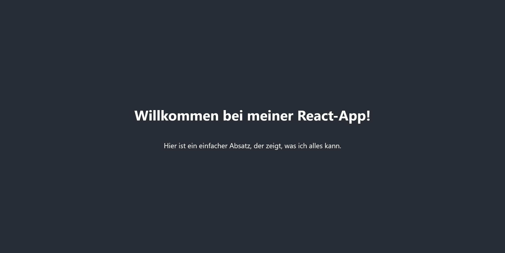

# React - Hello, world!
Grundlage für nachfolgende Ausführungen bildet https://react.dev.

# Was ist React?
ReactJS, kurz React, ist eine von Facebook entwickelte Open-Source-Bibliothek, mit welcher ansprechende und interaktive **Benutzeroberflächen** für Webanwendungen erstellt werden können. React zeichnet sich durch seine Komponenten-basierte Architektur aus, die es erlaubt, Benutzeroberflächen in **kleinere** und **wiederverwendbare** Bausteine zu zerlegen.

# Was spricht für den Einsatz von React im Frontend?
React wurde entwickelt, um einige Herausforderungen bei der Erstellung komplexer Webanwendungen zu bewältigen. Hier sind ein paar Gründe, warum es so beliebt ist:

- **Komponentenbasierte Architektur**: Mit React man Benutzeroberfläche in unabhängige Komponenten aufteilen, die jeweils ihr eigenes Verhalten und ihre eigene Darstellung haben. Dies fördert eine klare Struktur und Wiederverwendbarkeit des Codes.

- **Virtual DOM**: React verwendet ein virtuelles DOM (Document Object Model), das es ermöglicht, nur jene Teile der Benutzeroberfläche neu zu rendern, die sich geändert haben. Dies führt zu einer verbesserten Leistung und reibungsloseren Benutzererfahrung - in der Regel!

- **Einwegdatenfluss**: Der Einwegdatenfluss in React basiert auf den Komponenten, die man verschachteln kann. Dadurch "fließen" Daten von der obersten Elternkomponente zu den untergeordneten Kindkomponenten, aber nicht andersherum. Dies fördert eine klare und vorhersehbare Datenflussrichtung, was die Entwicklung und das Debugging von React-Anwendungen erleichtert.

- **Umfassendes Ökosystem**: React wird von einer großen und aktiven Community unterstützt und verfügt über ein umfangreiches Ökosystem von Bibliotheken und Werkzeugen, die die Entwicklung erleichtern.

Natürlich bringt der Einsatz von React auch potenzielle Nachteile mit sich:
- **Lernkurve**: Die Einarbeitung kann ein steile Lernkurve bedeuten - vor allem dann, wenn man nicht mit JS vertraut ist.
- **Komplexität**:  Für kleinere oder weniger komplexe Anwendungen kann React möglicherweise überdimensioniert sein.
- **Performance bei großen Datenmengen**: Das virtuelle DOM kann bei großen Datenmengen auch zum Nachteil werden.
- **UI-Bibliothek**: React ist "nur" eine UI-Bibliothek, die entweder den Einsatz weiterer Bibliotheken (für das Routing o. die Zutandsverwaltung) oder gleich eines Frameworks (wie Next.js) erfordert.
- **...**

# Erste Schritte
React kann man prinzipiell auch ohne Node.js verwenden, indem man die Bibliothek aus einen CDN in seinem HTML-Dokument einbindet und dann in weiterer Folge verwendet:
````html
<script crossorigin src="https://unpkg.com/react@18/umd/react.development.js"></script>
<script crossorigin src="https://unpkg.com/reactdom@18/umd/react-dom.development.js"></script>
````

In der Praxis wird jedoch empfohlen, Node.js und npm zu verwenden, da sie die Entwicklung und Bereitstellung von React-Anwendungen erheblich vereinfachen.

## Installation von Node.js
Falls Node.js noch nicht installiert ist, kann das entsprechende Paket von https://nodejs.org/en/download geladen werden. Mittels Kommandozeile kann man überprüfen, ob Node.js (mit welcher Version) installiert ist:
````shell
node -v
````
Node.js ist eine Open-Source-JavaScript-Laufzeitumgebung, die es ermöglicht, JavaScript-Code außerhalb eines Webbrowsers auszuführen. Es basiert auf der V8-JavaScript-Engine von Google Chrome und ermöglicht die Ausführung von JavaScript auf dem Server. Die Rolle von Node.js bei React besteht darin, eine Umgebung bereitzustellen, in der React-Anwendungen entwickelt, ausgeführt und bereitgestellt werden können.

## React-Projekt erstellen
Um die Komplexität zu reduzieren, verwenden wir React **ohne** weiteres Framework wie Next.js. Das macht's es dann doch ein wenig einfacher für uns beim Kennenlernen von React. 

Navigieren Sie in einen beliebigen Ordner, in welchem das React-Projekt erstellt werden soll. Das muss nicht zwangsläufig ein Unterordner der Apache-htdocs-Ordner sein.

Das React-Projekt *helloworld* mit `npx`, dem *Node Package Runner* erstellen:
````shell
npx create-react-app helloworld
````

Lesen Sie den Kommandozeilen-Output des vorherigen Befehlers. Die letzten Zeilen lauten:
````shell
We suggest that you begin by typing:

  cd helloworld
  npm start

Happy hacking!
````
Diesen Anweisungen folgen wir! Durch die Ausführung von `npm start` wird die Anwendung unter //127.0.0.1:3000 gestartet und automatisch im Browser geöffnet. Dabei sollte das React-Logo sichtbar sein.

Betrachtet man den Inhalt des Projektordners `helloworld` wird deutlich, dass das Kommando `create-react-app` einiges bewrikt. Im Prinzip wird alles kopiert und erstellt, was eine lauffähige React-Anwendung braucht. Hintergründe zu `create-react-app` sind der Projekt Website https://create-react-app.dev/ zu entnehmen (siehe *Getting Started*). Ausführliche Details zur erstellten Ordnerstruktur liefert diese Quelle https://medium.com/@abesingh1/create-react-app-files-folders-structure-explained-df24770f8562. 

Wenn man die App mit `npm start` ausführt, passiert folgendes im Hintergrund:

**Schritt 1**: Der Einstiegspunkt der React-App ist die `index.html` des `public`-Ordners. Diese Datei dient als Startpunkt der App.

````html
  ...
  <body>
    <noscript>You need to enable JavaScript to run this app.</noscript>
    <div id="root"></div>
    <!--
      To begin the development, run `npm start` or `yarn start`.
      To create a production bundle, use `npm run build` or `yarn build`.
    -->
  </body>
  ...
````

**Schritt 2**: Der zweite Punkt ist die Datei `index.js`, die sich im Ordner `src` befindet.

````javascript
const root = ReactDOM.createRoot(document.getElementById('root'));
root.render(
  <React.StrictMode>
    <App />
  </React.StrictMode>
);
````
**Schritt 3**: Abschließend kommt die *Root-Komponente* `App.js` ins Spiel, die sich ebenfalls im Ordner `src` befindet.
````javascript
function App() {
  return (
    <div className="App">
      <header className="App-header">
        
        <p>
          Edit <code>src/App.js</code> and save to reload.
        </p>
        <a
          className="App-link"
          href="https://reactjs.org"
          target="_blank"
          rel="noopener noreferrer"
        >
          Learn React
        </a>
      </header>
    </div>
  );
}

export default App;
````
Zusammenhang der Files im Überblick:

> index.html > index.js > App.js > Child Components

**Hinweis**: Um die Anwendung wieder zu stoppen, die Tastenkombination 'Strg + C' drücken. 

**>>Task 1**: Ändern Sie die React App dahingehend, dass folgende Ausgabe im Browser erzielt wird:



Gratulation! Sie haben soeben ihren ersten JSX-basierten Code-Zeilen verfasst. JSX steht für *JavaScript XML* und ist eine JavaScript-Erweiterung, die es ermöglicht, HTML-ähnlichen Code in JavaScript bzw. auf JavaScript-Ebene zu schreiben. 

**>>Task 2**: Nehmen Sie diese Quelle https://react.dev/learn/writing-markup-with-jsx zum Thema JSX durch.

