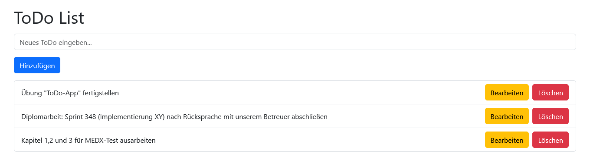

# ToDo-Liste mit React

Entwickeln Sie eine einfache ToDo-Anwendung mit React, die es dem Benutzer/der Benutzerin ermöglicht, eine Liste von Aufgaben zu verwalten. Die Anwendung sollte die folgenden Funktionen bieten:

## Funktionale Anforderungen

1. **Anzeige von vorhandenen Todos**: Beim Start der Anwendung sollten bereits die drei *hard-coded* Todos in der Liste angezeigt werden.

````javascript
[
    'Übung "ToDo-App" fertigstellen',
    'Diplomarbeit: Sprint 348 (Implementierung XY) nach Rücksprache mit unserem Betreuer abschließen',
    'Kapitel 1,2 und 3 für MEDX-Test ausarbeiten',
  ]
````

2. **Hinzufügen neuer Todos**: Der/Die Benutzer*in sollte die Möglichkeit haben, neue Todos hinzuzufügen, indem er/sie einen Text eingibt und auf den Button "Hinzufügen" klickt.

3. **Bearbeiten von Todos**: Der/Die Benutzer*in sollte in der Lage sein, den Text eines vorhandenen Todos zu bearbeiten, indem er/sie auf einen "Edit"-Button klickt und den neuen Text eingibt. Hierbei kann die `prompt("Text eingeben: ", "");`-Funktion verwendet werden, um eine Eingabedialogbox im Browser anzuzeigen. Diese Dialogbox enthält normalerweise eine Nachricht, ein Eingabefeld und zwei Schaltflächen: "OK" und "Abbrechen". Als Return-Wert erhält man die Texteingabe oder *null* (bei fehlender Eingabe). 

4. **Löschen von Todos**: Der/Die Benutzer*in sollte Todos aus der Liste entfernen können, indem er/sie auf einen "Delete"-Button neben dem jeweiligen Todo klickt. Eine weitere Abfrage, ob das Löschen tatsächlich gewünscht ist, ist nicht erforderlich.

## Design-Anforderungen

1. **Ansprechendes Design**: Verwenden Sie das React-Bootstrap-Paket (siehe letzte Übung), um ein ansprechendes Design für die Anwendung zu erstellen.

Prinzipiell ist es in Ordnung, die Anwendung in einer einzigen Datei, der `App.js`, zu implementieren (einschließlich CSS-Styling).

**Hinweis:** Achten Sie darauf, dass die Anwendung übersichtlich und benutzerfreundlich ist. Kommentieren Sie Ihren Code, um seine Funktionsweise zu erklären, und testen Sie die Anwendung gründlich, um sicherzustellen, dass sie wie erwartet funktioniert.

**>>Task 1**: Setzen Sie die oben definierten Anforderungen um. Nachfolgender Screenshot bzw. Codeauszug sollen hierbei als Inspiration dienen.

<div class="text-center">
  
</div>

Eingesetzte Boostrap-React-Komponenten:
````js
      <Container >
        <h1> ... </h1>
        <Form.Control
            ...
        />
        <Button> ...  </Button>
        <ListGroup>
            // Items
        </ListGroup>
      </Container>
````

Happy Coding ;) 