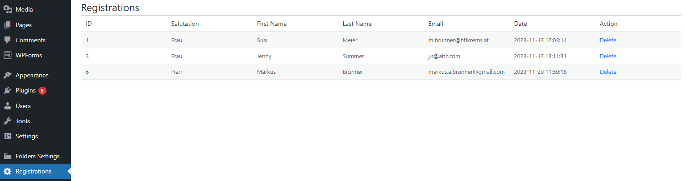
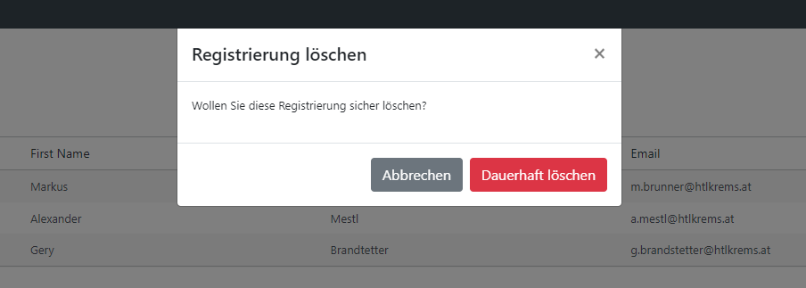

# Wordpress Plugin Development III - Event Registration

Ziel ist die Entwicklung eines Plugins, das einerseits die Anmeldung zu einer Veranstaltung ermöglicht und andererseits jene Backend-Funktionalitäten bereitstellt, die es zur Speicherung sowie Einsicht und Bearbeitung von Anmeldung braucht. Das Plugin ist als *Shortcode* zu implementieren. Schlussendlich soll es an beliebiger Stelle eingebunden werden könnnen.

Ausgangslage bildet das in Übung 1 (siehe http://htl.boxtree.at/lehre/wp-content/uploads/MEDW5/MEDW5_WordpressProjectEcoTech-v0.2.pdf, Punkt 3 "Anmeldeseite") entwicklete Formular, das es in Form eines Plugins abzulösen gilt. Der Einfachheit halber werden die Anforderungen an das plugin-basierte Formular auf folgende **vier** Formularbestandteile konsolidiert:

- Anrede (für Frau, Herr, ...)
- Vorname
- Nachname
- E-Mail

Eine mögliche Darstellung im Frontend:


> Selbstverständlich kann diese an das eigene Look & Feel in UE1 angepasst werden. Achten Sie jedoch auf eine ansprechende Umsetzung, die einer Medientechnikern/eines Medientechnikers würdig ist!

## Plugin Meta Daten
- Plugin Name: HTL Event Registration
- Description: Elevate your event management capabilities with the HTL Event Registration plugin. This powerful tool, crafted by HTL Super Coder, allows you to seamlessly handle event registrations on your WordPress site.
- Version: 1.0
- Author: HTL Super Coder
- Date: xy.xy.2023

## Umsetzung Frontend Ausgabe
Implementieren Sie die Frontend-Ausgabe gemäß Anforderung. Verwenden Sie hierbei folgendes Grundgerüst:

````php
<?php
/**
 * Plugin Name: HTL Event Registration
 * Description: Elevate your event management capabilities with the HTL Event Registration plugin. This powerful tool, crafted by HTL Super Coder, allows you to seamlessly handle event registrations on your WordPress site.
 * Version: 1.0
 * Author: HTL Super Coder
 * Date: xy.xy.2023
 */


function registration_form() {
    ob_start(); // Start output buffer
    
    // Process the form when submitted
    if (/* Your trigger */) {
       
        // Here you can save or process the user data        
        // For example: register user, save to the database, etc.

        echo '<p>Danke für Ihre Registrierung!</p>';
    } else {
        // Display the styled form if not submitted
        ?>
        <style>
            /*Some styling!*/
        </style>


        <?php
        return ob_get_clean(); // Return the output buffer
    }
}

// Register the shortcode 'htl_registration_form'

?>

````

> **Hinweis:** Als Shortcode ist **`htl_registration_form`** zu verwenden! 

**>> Task 1**: Im ersten Schritt gilt es die getätigten Eingaben auf einfache Art und Weise auszugeben. Verwenden Sie hierbei die Funktion `sanitize_text_field` bei der Ausgabe. Ein mögliches Ergebnis zeigt nachfolgender Screenshot:  


## WordPress Database Class
`$wpdb` ist eine Instanz der *WordPress Database Class* und stellt eine Schnittstelle zum Arbeiten mit der Datenbank in WordPress bereit. Der Name `$wpdb` steht für "WordPress Database" und ermöglicht Entwicklern den sicheren Zugriff auf die WordPress-Datenbank ohne direkte **SQL-Abfragen** verwenden zu müssen. Details liefert diese Quelle: https://developer.wordpress.org/reference/classes/wpdb/

> **Kurzum**: `$wpdb` stellt eine Verbindung zu jener Datenbank bereit, die bei der Installation von Worpress konfiguriert wurde! 

Die Klasse stellt eine Reihe nützlicher Methoden bereit, die das Arbeiten mit der Datenbank vereinfachen. Angenommen, wir haben die Wordpress-DB um die Tabelle *wp_students* (mit den Feldern id, Vorname und Nachname) erweitert, kann wie folgt auf darauf zugegriffen werden:  

````php
// Globale Instanz der Instanz der WordPress Database Class verfügbar machen 
global $wpdb;
// Tabellen-Prefix (z.B. wp oder htl) mit Tabellenbezeichner zusammenfügen
$table_name = $wpdb->prefix . 'students';
// Query mit get_result ausführen
$results = $wpdb->get_results("SELECT * FROM $table_name");
// Einfache Ausgabe
var_dump($results);

````

**Stichwort SQL-Injections**: Um sichere SQL-Statements auszuführen, stellt die Klasse die Methode `prepare` bereit. Diese gilt es immer dann einzusetzen, wenn es sinnvoll bzw. unerlässlich ist! Details liefert die Klassendokumentation: https://developer.wordpress.org/reference/classes/wpdb/#protect-queries-against-sql-injection-attacks

Die oben vorgestellte Abfrage setzt voraus, dass die Tabelle *students* existiert. Um Tabellen im Zuge der Plugin-Aktivierung zu erstellen, dient der sog. *activation_*-Hook. Dieser wird bei Aktivierung des Plugins schlagend und die entsprechende Callback-Funktion angeführt. 

````php

function activate_my_plugin() {
    global $wpdb;

    $table_name = $wpdb->prefix . 'students';

    $charset_collate = $wpdb->get_charset_collate();

    $sql = "CREATE TABLE $table_name (
        id mediumint(9) NOT NULL AUTO_INCREMENT,
        first_name varchar(255) NOT NULL,
        last_name varchar(255) NOT NULL,
        PRIMARY KEY  (id)
    ) $charset_collate;";

    // Das Ausführen des Statements erfolgt durch 'dbDelta()`, diese muss zuvor eingebunden werden!
    require_once(ABSPATH . 'wp-admin/includes/upgrade.php');
    dbDelta($sql);
}

// Die Funktion 'register_activation_hook' erwartet zwei Parameter: den Dateipfad des Plugins und den
// Namen der Aktivierungshook-Funktion. Durch die Verwendung von __FILE__ als ersten Parameter stellt 
// man sicher, dass der Pfad zum aktuellen Plugin korrekt übergeben wird. 

register_activation_hook(__FILE__, 'activate_my_plugin');

````

Weiterführende Details liefert diese Quelle: https://codex.wordpress.org/Creating_Tables_with_Plugins

**>>Task 2:** Erweitern Sie das Plugin dahingehend, dass die Eingaben in der DB-Tabelle `registrations` gespeichert werden. Neben den Formularinhalten ist auch noch das Registrierungsdatum zu speichern. Erstellen Sie hierzu das Feld `registration_date`.   


**>>Task 3:** Den vorläufig letzten Schritt stellt die Ausgabe der Anmeldung im Backend dar. Erweitern Sie das Menü um den Eintrag "Registrations". Nach erfolgtem Klick darauf sind sämtliche Anmeldungen in einer HTML-Tabelle auszugeben. Mögliches Ergebnis:


Im Beispielsfall wurden bei der HTML-Tabelle im Backend folgenden *classes* verwendet: `<table class="wp-list-table widefat fixed striped">` Quelle: https://developer.wordpress.org/reference/classes/wp_list_table/

## Backend-Erweiterung "Anmeldung Löschen"
Erweitern Sie die Backend-Funktionalitäten des Plugins um die Funktion "Anmeldung löschen". Fügen Sie hierfür eine zusätzliche Spalte mit dem Titel "Action" hinzu, wie in der nachfolgenden Abbildung dargestellt. Das Löschen einer Anmeldung hat durch einen Klick auf den entsprechenden "Delete"-Link zu erfolgen.



Ausgangspunkt für die Erweiterung ist die PHP-Funktion `htl_event_registration_page`. In dieser ist sämtlicher Code zu implementieren. Nachfolgender HTML-Codeauszug zeigt den Aufbau der zu erstellenden Links am Beispiel der Anmeldung mit der ID 6. 

````html
...
<td><a href="?page=htl-registrations&action=delete&registration_id=6">Delete</a></td>
...
````

Im Detail:

- `page=htl-registrations`  Das Markup der HTML-Tabelle wird, wie bereits festgehalten, in der Funktion `htl_event_registration_page` generiert. Daher ist es notwendig, dass die Löschanforderung mit allen erforderlichen Informationen in dieser Funktion landet. Um dies zu erreichen, wird der Paramter *page* mit dem Wert *htl-registration* verwendet. Dies wurde in der Funktion `htl_event_registration_menu` bzw. `add_menu_page` (Quelle: https://developer.wordpress.org/reference/functions/add_menu_page/) so festgelegt. Beim Hinzufügen des Backend-Menüeintrages wurde außerdem die Callback-Funktion definiert, die dann in weiterer Folge ausgeführt wird, und das ist, Überraschung, die die Funktion `htl_event_registration_page`. Somit schließt sich der Kreis.

````php
function htl_event_registration_menu()
{
    add_menu_page(
        'Registrations',
        'Registrations',
        'manage_options',
        'htl-registrations', // <== Wert für den Parameter 'page'
        'htl_event_registration_page' 
    );
}
````
- `action=delete`: Hierbei handelt es sich um einen Parameter, der angibt, welche Aktion auf der verlinkten Seite ausgeführt werden soll.
- `registration_id:` Jener Parameter, der als Löschkriterium dient.

Hinweise:
- Übergeben Sie die `registration_id=6` an die Funktion `intval`, bevor Sie diese weiterverarbeiten (Quelle: https://www.php.net/manual/de/function.intval.php)
- Das Löschen kann dann mittels `$wpdb->delete($table_name, array('id' => $registration_id), array('%d'));` erfolgen.


**>>Task 4:** Setzen Sie die Backend-Funktionalitäten "Eintrag löschen" um. 

**>>Task 5:** Lösen Sie den Hyperlink-Text "Delete" durch ein entsprechendes Icon (z.B. Mistkübel) ab.

## Backend-Erweiterung "Sicherheitasbfrage beim Löschen"
Um die Backend-Funktionalitäten des Plugins "sicherer" zu gestalten, möchten wir eine Sicherheitsabfrage hinzufügen, bevor ein Eintrag elöscht wird. Statt den Eintrag sofort zu löschen, soll der Benutzer zunächst bestätigen, dass er den Eintrag wirklich löschen möchte.

Im Prinzip braucht es drei Erweiterungsmaßnahmen:
1. Implementierung des Bootstrap-Modal Dialogs
2. JavaScript-Implementierung für *Click Event* und Ajax-Request
3. Anpassung der serverseitigen Bearbeitung der "Löschaufforderung" 


#### Bootstrap-Modal Dialogs
Erweitern Sie die Löschoption um eine Sicherheitsabfrage mittels eines Bootstrap-Modal Dialogs (beispielhafte Umsetzung siehe nachfolgende Abbildung). Erst nach Betätigung des Buttons "Dauerhaft löschen" darf der Eintrag in der Datenbank entfernt werden. 



Details bzgl. Verwendung eines Bootstrap-Modals sind dieser Quelle zu entnehmen: https://getbootstrap.com/docs/5.3/components/modal/#live-demo

Um mit Bootstrap-Modals arbeiten zu können, braucht es neben der *bootstrap.min.js* die *bootstrap.min.css*. Diese gilt es im Plugin-File einzubinden. 

`````php
function load_bootstrap_in_admin() {
    wp_enqueue_style('bootstrap', 'https://stackpath.bootstrapcdn.com/bootstrap/4.3.1/css/bootstrap.min.css');
    wp_enqueue_script('bootstrap', 'https://stackpath.bootstrapcdn.com/bootstrap/4.3.1/js/bootstrap.min.js', array('jquery'), '4.3.1', true);
}

add_action('admin_enqueue_scripts', 'load_bootstrap_in_admin');
``````

Im Detail: 
- `wp_enqueue_style`: Diese Funktion wird verwendet, um Stylesheets in WordPress zu laden. Hier wird die Bootstrap CSS-Datei von der angegebenen URL in den Admin-Bereich eingebunden.

- `wp_enqueue_script`: Diese Funktion wird verwendet, um JavaScript-Dateien in WordPress zu laden. Hier wird die Bootstrap JavaScript-Datei von der angegebenen URL in den Admin-Bereich eingebunden. Das Array `array('jquery')` gibt an, dass Bootstrap von jQuery abhängt und sicherstellt, dass jQuery zuerst geladen wird. Die Versionsnummer '4.3.1' wird als Argument übergeben, und `true` legt fest, dass das Skript im Footer der Seite geladen wird.

#### JavaScript-Implementierung für *Click Event* und Ajax-Request
Genau genommen umfasst der Lösch-Prozess 2 Stufen:
- Im ersten Schritt gilt es den Dialog zu öffnen. Hierzu stellt das Bootstrap-JS-API die Funktion `modal(...)` bereit (mögliches Anwendungsbeipsiel `$('#confirmationModal').modal('show');`, wenn die ID des Dialoges auf HTML-Ebene *confirmationModal* lautet). Auszuführen ist `modal('show')` nach einem Klick auf das Lösch-Icon. Das setzt einen entsprechenden *Click Event Listener*, der an das Icon gebunden ist, voraus. 

- Der Lösch-Request wird durch einen Klick auf den Button "Dauerhaft löschen" abgesetzt. Demnach ist auch in diesem Fall ein entsprechender *Click Event Listerner* erforderlich, der beim Eintreten des Events (= Klick auf Button), die Callback-Funktion mit dem AJAX-Request ausführt. Für sämtlichen JS-Code empfiehlt sich die Erstellung einer separaten JS-Datei `app.js`, die sich im selben Verzeichnis, wie das Plugin-File, befinden kann. Diese ist Wordpress ebenfalls bekanntzumachen:

```php
function load_custom_wp_admin_scripts() {
    wp_enqueue_script('custom_script', plugin_dir_url(__FILE__) . 'app.js', array('jquery'), '1.0', true);
}

add_action('admin_enqueue_scripts', 'load_custom_wp_admin_scripts');
```

> **Hinweis 1**: Selbstverständlich kann man beide *action hooks*, die einerseits Bootstrap-JS/CSS und andererseits *custom-JS* laden, in einem zusammenführen. Feel free!

> **Hinweis 2**: Nachdem der AJAX-Request abgesetzt wurde, erfolgt serverseitig das Löschen des Eintrages. Zu diesem Zeitpunkt sind die Einträge in der HTML-Tabelle (im WP-Backend) und jene in der DB-Tabelle asynchron. Eine einfache, wenn auch nicht ganz so tolle Lösung, stellt der Aufruf von `window.location.href = '?page=htl-registrations';` in der *response callback* des AJAX-Requests dar. Dieser bewirkt, dass die aktuelle Seite nochmals geladen wird. Alternativ müsste man die entsprechende Zeile der HTML-Tabelle mittels JS entfernen, wenn das Löschen erfolgreich vonstatten gegangen ist.     

#### Anpassung der serverseitigen Bearbeitung der "Löschaufforderung" 
Mit dem AJAX-Request werden - hoffentlich! - all jene Informationen an das serverseitige Plugin-Script übermittelt, die den eingehenden Request als "Löschaufforderung" identifizieren und in weiterer Folge die Durchführung des *DELETE*-Statements ermöglichen. Kurzum: Eine saubere Lösung wird 2 Parameter benötigen. Der serverseitige Implementierungsaufwand ist jedoch überschaubar.
