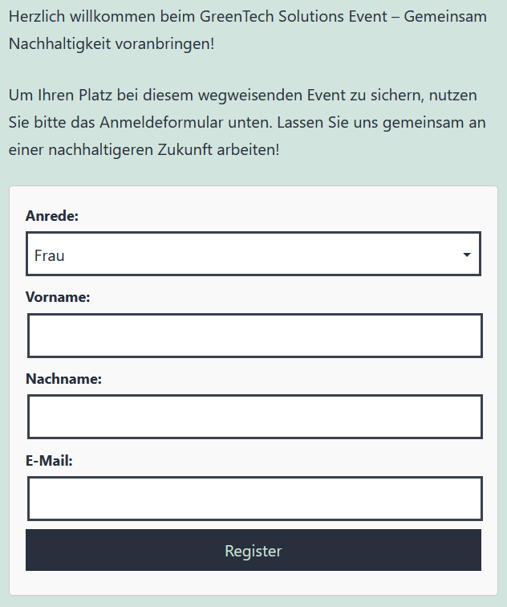
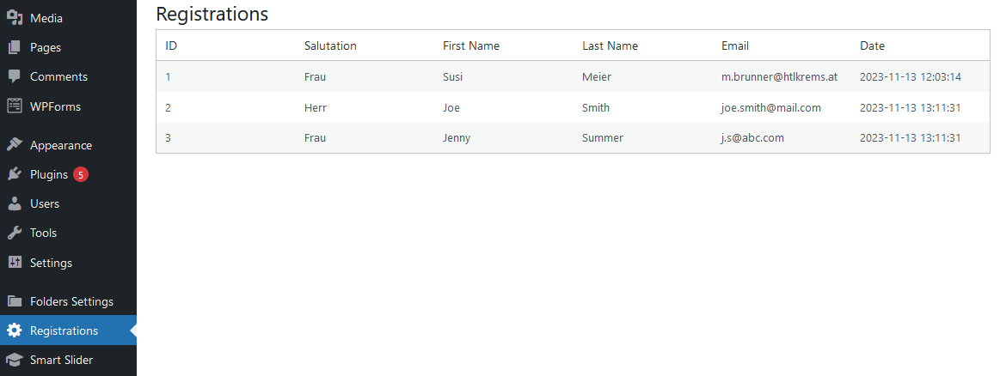

# Wordpress Plugin Development III - Event Registration

Ziel ist die Entwicklung eines Plugins, das einerseits die Anmeldung zu einer Veranstaltung ermöglicht und andererseits jene Backend-Funktionalitäten bereitstellt, die es zur Speicherung sowie Einsicht und Bearbeitung von Anmeldung braucht. Das Plugin ist als *Shortcode* zu implementieren. Schlussendlich soll es an beliebiger Stelle eingebunden werden könnnen.

Ausgangslage bildet das in Übung 1 (siehe http://htl.boxtree.at/lehre/wp-content/uploads/MEDW5/MEDW5_WordpressProjectEcoTech-v0.2.pdf, Punkt 3 "Anmeldeseite") entwicklete Formular, das es in Form eines Plugins abzulösen gilt. Der Einfachheit halber werden die Anforderungen an das plugin-basierte Formular auf folgende **vier** Formularbestandteile konsolidiert:

- Anrede (für Frau, Herr, ...)
- Vorname
- Nachname
- E-Mail

Eine mögliche Darstellung im Frontend:


> Selbstverständlich kann diese an das eigene Look & Feel in UE1 angepasst werden. Achten Sie jedoch auf eine ansprechende Umsetzung, die einer Medientechnikern/eines Medientechnikers würdig ist!

## Plugin Meta Daten
- Plugin Name: HTL Event Registration
- Description: Elevate your event management capabilities with the HTL Event Registration plugin. This powerful tool, crafted by HTL Super Coder, allows you to seamlessly handle event registrations on your WordPress site.
- Version: 1.0
- Author: HTL Super Coder
- Date: xy.xy.2023

## Umsetzung Frontend Ausgabe
Implementieren Sie die Frontend-Ausgabe gemäß Anforderung. Verwenden Sie hierbei folgendes Grundgerüst:

````php
<?php
/**
 * Plugin Name: HTL Event Registration
 * Description: Elevate your event management capabilities with the HTL Event Registration plugin. This powerful tool, crafted by HTL Super Coder, allows you to seamlessly handle event registrations on your WordPress site.
 * Version: 1.0
 * Author: HTL Super Coder
 * Date: xy.xy.2023
 */


function registration_form() {
    ob_start(); // Start output buffer
    
    // Process the form when submitted
    if (/* Your trigger */) {
       
        // Here you can save or process the user data        
        // For example: register user, save to the database, etc.

        echo '<p>Danke für Ihre Registrierung!</p>';
    } else {
        // Display the styled form if not submitted
        ?>
        <style>
            /*Some styling!*/
        </style>


        <?php
        return ob_get_clean(); // Return the output buffer
    }
}

// Register the shortcode 'htl_registration_form'

?>

````

> **Hinweis:** Als Shortcode ist **`htl_registration_form`** zu verwenden! 

**>> Task 1**: Im ersten Schritt gilt es die getätigten Eingaben auf einfache Art und Weise auszugeben. Verwenden Sie hierbei die Funktion `sanitize_text_field` bei der Ausgabe. Ein mögliches Ergebnis zeigt nachfolgender Screenshot:  


## WordPress Database Class
`$wpdb` ist eine Instanz der *WordPress Database Class* und stellt eine Schnittstelle zum Arbeiten mit der Datenbank in WordPress bereit. Der Name `$wpdb` steht für "WordPress Database" und ermöglicht Entwicklern den sicheren Zugriff auf die WordPress-Datenbank ohne direkte **SQL-Abfragen** verwenden zu müssen. Details liefert diese Quelle: https://developer.wordpress.org/reference/classes/wpdb/

> **Kurzum**: `$wpdb` stellt eine Verbindung zu jener Datenbank bereit, die bei der Installation von Worpress konfiguriert wurde! 

Die Klasse stellt eine Reihe nützlicher Methoden bereit, die das Arbeiten mit der Datenbank vereinfachen. Angenommen, wir haben die Wordpress-DB um die Tabelle *wp_students* (mit den Feldern id, Vorname und Nachname) erweitert, kann wie folgt auf darauf zugegriffen werden:  

````php
// Globale Instanz der Instanz der WordPress Database Class verfügbar machen 
global $wpdb;
// Tabellen-Prefix (z.B. wp oder htl) mit Tabellenbezeichner zusammenfügen
$table_name = $wpdb->prefix . 'students';
// Query mit get_result ausführen
$results = $wpdb->get_results("SELECT * FROM $table_name");
// Einfache Ausgabe
var_dump($results);

````

**Stichwort SQL-Injections**: Um sichere SQL-Statements auszuführen, stellt die Klasse die Methode `prepare` bereit. Diese gilt es immer dann einzusetzen, wenn es sinnvoll bzw. unerlässlich ist! Details liefert die Klassendokumentation: https://developer.wordpress.org/reference/classes/wpdb/#protect-queries-against-sql-injection-attacks

Die oben vorgestellte Abfrage setzt voraus, dass die Tabelle *students* existiert. Um Tabellen im Zuge der Plugin-Aktivierung zu erstellen, dient der sog. *activation_*-Hook. Dieser wird bei Aktivierung des Plugins schlagend und die entsprechende Callback-Funktion angeführt. 

````php

function activate_my_plugin() {
    global $wpdb;

    $table_name = $wpdb->prefix . 'students';

    $charset_collate = $wpdb->get_charset_collate();

    $sql = "CREATE TABLE $table_name (
        id mediumint(9) NOT NULL AUTO_INCREMENT,
        first_name varchar(255) NOT NULL,
        last_name varchar(255) NOT NULL,
        PRIMARY KEY  (id)
    ) $charset_collate;";

    // Das Ausführen des Statements erfolgt durch 'dbDelta()`, diese muss zuvor eingebunden werden!
    require_once(ABSPATH . 'wp-admin/includes/upgrade.php');
    dbDelta($sql);
}

// Die Funktion 'register_activation_hook' erwartet zwei Parameter: den Dateipfad des Plugins und den
// Namen der Aktivierungshook-Funktion. Durch die Verwendung von __FILE__ als ersten Parameter stellt 
// man sicher, dass der Pfad zum aktuellen Plugin korrekt übergeben wird. 

register_activation_hook(__FILE__, 'activate_my_plugin');

````

Weiterführende Details liefert diese Quelle: https://codex.wordpress.org/Creating_Tables_with_Plugins

**>>Task 2:** Erweitern Sie das Plugin dahingehend, dass die Eingaben in der DB-Tabelle `registrations` gespeichert werden. Neben den Formularinhalten ist auch noch das Registrierungsdatum zu speichern. Erstellen Sie hierzu das Feld `registration_date`.   


**>>Task 3:** Den vorläufig letzten Schritt stellt die Ausgabe der Anmeldung im Backend dar. Erweitern Sie das Menü um den Eintrag "Registrations". Nach erfolgtem Klick darauf sind sämtliche Anmeldungen in einer HTML-Tabelle auszugeben. Mögliches Ergebnis:



Im Beispielsfall wurden bei der HTML-Tabelle im Backend folgenden *classes* verwendet: `<table class="wp-list-table widefat fixed striped">` Quelle: https://developer.wordpress.org/reference/classes/wp_list_table/
